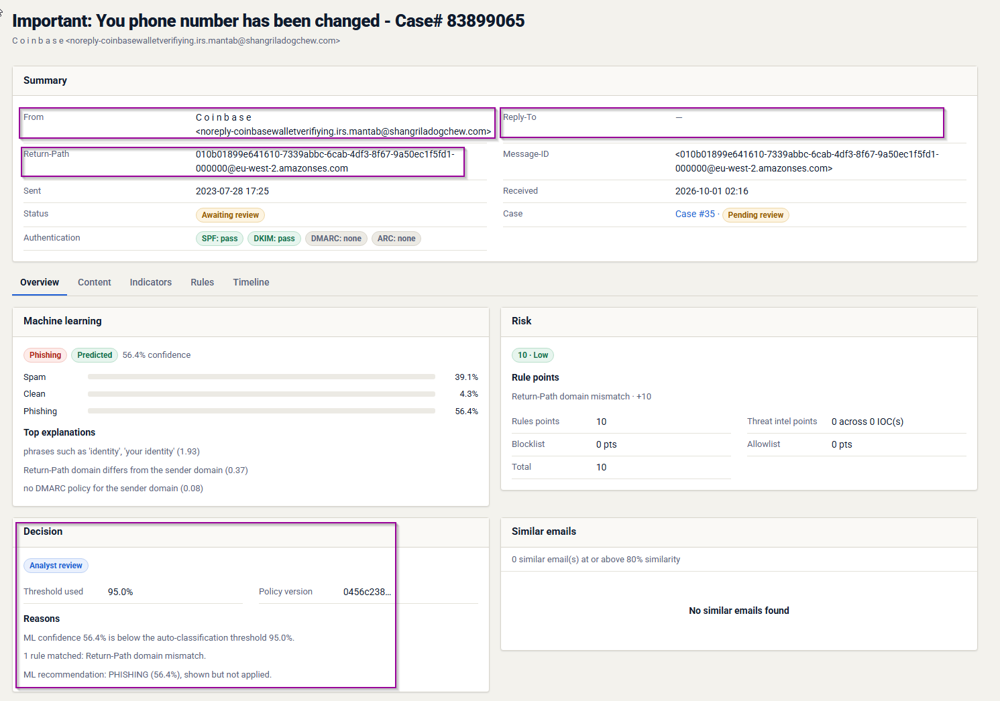
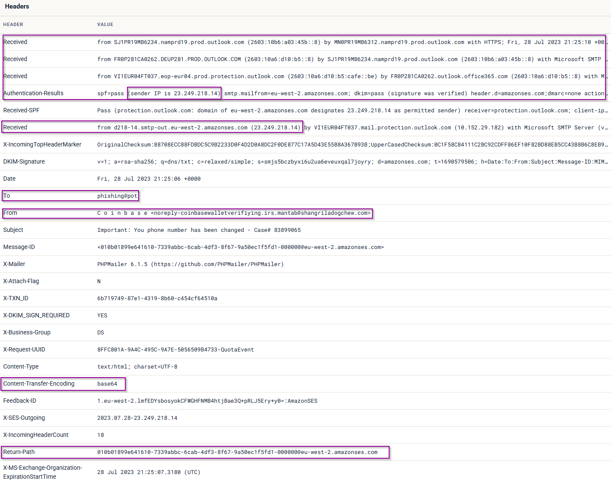
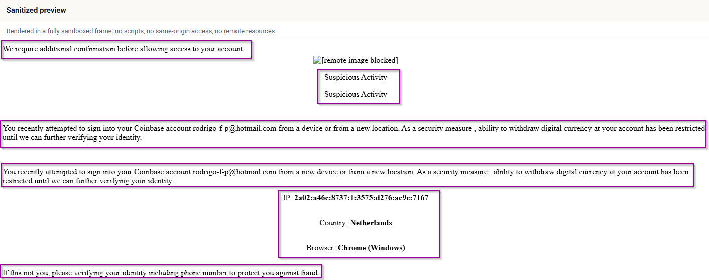
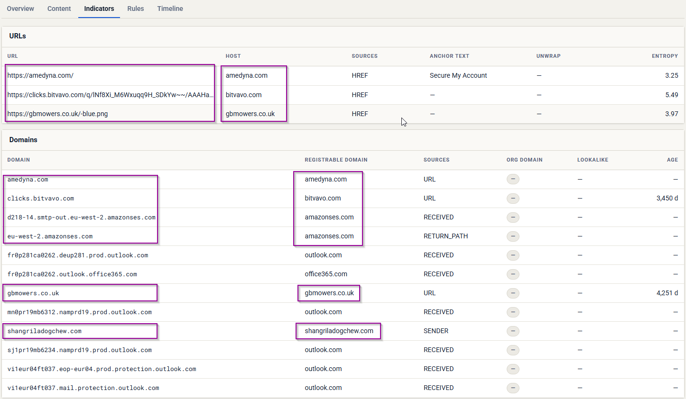

## Phishhound

Domain

```
Check the board
```

Email address:

```
come see me @phishhound.us
```

Password:

```
Phishhound-Demo-2026
```

-----
## Stuff to look at

- Incoherence in email content
- weird looking email address
- check the domain reputation on threat intel websites
- check if the email is addressing a specific person
- Sender's email different form reply-to email
- beware of weird links
- beware of attachments
- Are they asking to enable macro? (hell nah)
- pdf document? (can also be malicious)
____
## Links

[Security bookmark](https://raw.githubusercontent.com/MalwareCube/SOC101/refs/heads/main/resources/bookmarks/soc_bookmarks.html)

[urlscan.io](https://usrscan.io)
[Virus Total](https://virustotal.com)
[Cisco Talos](https://talosintelligence.com)

----
## Find some of the following during you analysis

- What is the subject line of the email?
```

```

- What is the Reply-To email address?
```

```

- What is the recipient email address?
```

```

- What company is the attacker trying to imitate?
```

```

- What is the location of the attacker in this Universe?
```

```

- When looking at the main body content in a text editor, what encoding scheme is being used?
```

```

- Look at the URL using URL2PNG. What is the first sentence (heading) displayed on this site? (regardless of whether you think the site is malicious or not)
```

```
----
## Screenshots to look at








